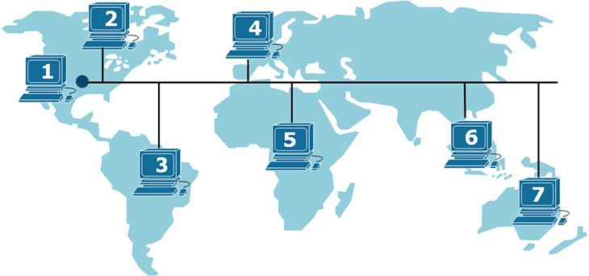
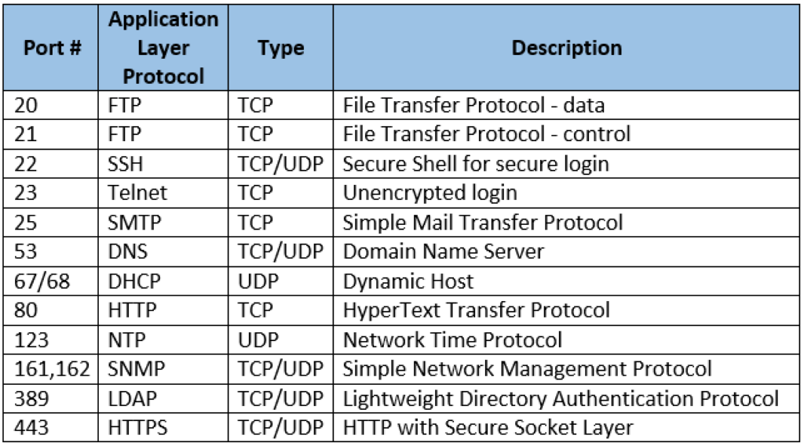
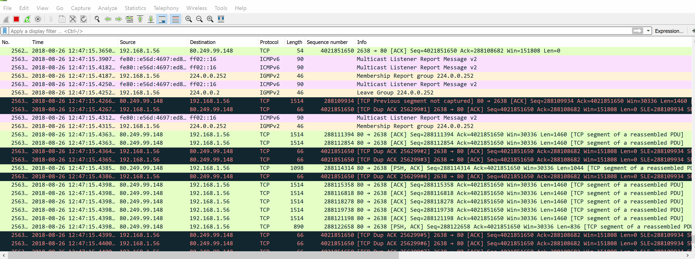

  
  <small>Networking is fun. Also, it is the part that keeps your hacks from breaking at the worst time.</small>

<big>So, you wanna be a hacker?</big>

Cool. I did too. I jumped into Kali, sprayed tools, and followed tutorials like a robot. Things worked, but I could not explain why. That was my first big lesson: **without networking, most of security looks like magic**. No magic here. Just packets, addresses, ports, and paths.

## The moment it clicked

I kept asking myself:
- Why does a reverse shell call me back and not the other way around?
- What does ``netstat -tunlp`` actually show me?
- Why does ``ping`` sometimes fail even though the server is up?

The answer was not a broken tool. It was me not understanding the path the packets had to travel.

## Learn these first

These are the pieces that changed my life in pentests and CTFs.

### 🔌 The OSI model

  
  <small>OSI and TCP/IP from <a href="https://www.practicalnetworking.net/series/packet-traveling/osi-model/">Practical Networking</a></small>

Think of it as a map. If you know the layer, you know where to debug.  
If you want to explore it in depth, check out:
- [Cisco OSI Model Overview](https://www.cisco.com/c/en/us/solutions/enterprise-networks/what-is-the-osi-model.html)
- [Packet Traveling Series by Practical Networking](https://www.practicalnetworking.net/series/packet-traveling/)

**Real world hints by layer:**
- **L1 Physical** - bad cable, wrong interface, Wi-Fi channel noise. If ``link`` lights are off, stop blaming the firewall.
- **L2 Data Link** - ARP and MAC. ARP spoofing lives here. If you see duplicate IP warnings, check the ARP table with ``ip neigh``.
- **L3 Network** - IP and routing. If 192.168.1.10 cannot reach 192.168.2.10, you likely need a router or a route.
- **L4 Transport** - TCP vs UDP. TCP handshake fails means no state created on the server. SYNs leaving but no SYN ACK returning usually means a path or filter issue.
- **L5 Session** - long lived connections. If a VPN drops every 30 minutes, look for session timers.
- **L6 Presentation** - certs and encodings. TLS errors like ``unsupported protocol`` live here.
- **L7 Application** - HTTP, DNS over HTTPS, SMTP. If the app returns 200 but nothing changes, it is probably an app logic bug, not the network.

### 🌐 IP addressing and subnetting

  
  <small>Subnetting overview from <a href="https://www.networkacademy.io/ccna/ip-subnetting/why-do-we-need-ip-subnetting">Network Academy</a></small>

You do not need to be a human subnet calculator. You do need to know:
- Private ranges: 10.0.0.0/8, 172.16.0.0/12, 192.168.0.0/16.
- What a mask does. ``/24`` means 256 addresses, ``/25`` splits that in half.
- Simple test: put one VM on 192.168.1.10/24 and another on 192.168.2.10/24. They will not ping without a router. Add a route and watch it work.

Want to practice subnetting?  
- [Subnetting Made Easy](https://www.subnetting.net/)
- [Subnetting Practice Game](https://subnettingpractice.com/)

### 🚪 Ports and protocols that actually matter

  
  <small>Know the defaults, then verify with a scan. Do not assume.</small>

Quick cheats you will use daily:
- **22 SSH** - remote shell. If login hangs after password, suspect TCP filtering or ``AllowUsers`` policy before you blame credentials.
- **80/443 HTTP/S** - everything from health checks to C2 beacons rides here. Proxies often rewrite requests. Capture and compare.
- **53 DNS** - resolution issues look like random failures. Test with ``dig @resolver_ip example.com`` to bypass system DNS.
- **445 SMB** - Windows auth and file shares. If ``smbclient`` fails only on large files, think MTU or signing.

More:  
- [IANA Service Name and Transport Protocol Port Number Registry](https://www.iana.org/assignments/service-names-port-numbers/service-names-port-numbers.xhtml)

### 📦 Packet flow and basic tools

  
  <small>Follow a TCP handshake. SYN, SYN ACK, ACK. It will save you hours.</small>

Tools I use in order when something breaks:
1. ``ping`` to test reachability. If ICMP is blocked, move on.
2. ``traceroute`` to see the path. Sudden star means a filter or NAT.
3. ``ss -tulnp`` or ``netstat -tunlp`` to list listeners.
4. ``tcpdump -nni eth0 port 443`` to confirm packets leave and return.
5. Wireshark for the story behind the packets.

### 🔥 NAT, DHCP, DNS, routing

  

This is the unsexy part that makes everything work.
- **NAT** hides private hosts. Reverse shells fail a lot here. Use a listener on a port allowed outbound.
- **DHCP** gives IPs. If two boxes fight for the same address, the lease server is probably duplicated or mis-scoped.
- **DNS** is the phonebook. If a domain resolves to different IPs than you expect, check split horizon and hosts files.
- **Routing** decides the next hop. Wrong default gateway is the classic silent killer.

Learn more:  
- [NAT Explained – IPCisco](https://ipcisco.com/lesson/nat-network-address-translation/)
- [How DHCP Works – Microsoft Learn](https://learn.microsoft.com/en-us/windows-server/networking/technologies/dhcp/dhcp-top)
- [DNS in detail – Cloudflare Learning](https://www.cloudflare.com/learning/dns/what-is-dns/)

---

## Learn stack without pain

What helped me when I started:
- **[TryHackMe Network Fundamentals module](https://tryhackme.com/module/network-fundamentals)** – hands-on labs.
- **[Professor Messer Network+ videos](https://www.professormesser.com/network-plus/n10-009/n10-009-video/n10-009-training-course/)** – structured theory.
- **[Packet Tracer](https://www.netacad.com/cisco-packet-tracer)** or **[GNS3](https://www.gns3.com/)** – virtual routers/switches without real gear.
- **[Wireshark](https://www.wireshark.org/)** – see the truth on the wire.

If you are on Linux, make ``nmap``, ``netcat``, ``ip``, and ``ss`` part of your daily toolkit.

---

## What to do right after reading (Practical Exercises)

1. Capture your browser loading a site in Wireshark and find the three-way handshake.
2. Split 192.168.1.0/24 into two /25s. Put two VMs on different halves and make them ping using a router VM.
3. Run ``ss -tulnp`` then open a new ``nc -lvp 4444`` listener and watch the new entry appear.

---

## Why this matters in real attacks

When you understand networking:
- ARP spoofing, DNS poisoning, and MITM are not tricks. They are predictable outcomes you can detect and block.
- You stop pasting scripts and start fixing root causes.
- You can explain failures to a client in plain English and get them fixed the same day.

---

## Final words

Networking is not flashy, but it is the floor under your feet. Build it solid now and future you will move faster, break less, and spend more time popping shells than debugging routes.

---

If you are stuck, tell me what you tried and what you saw on the wire. I will help you untangle it step by step.
